# A Remotely Operated Boat Equipped with a Set of Sensors

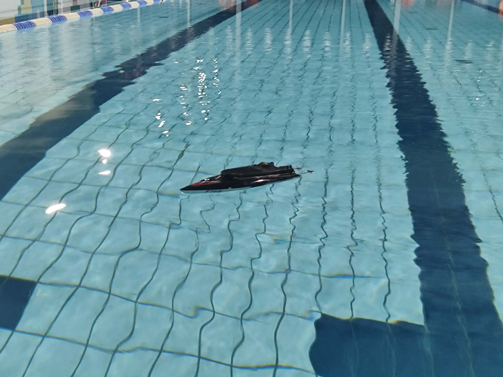

Bachelor’s engineering thesis, Poznań University of Technology, 2026.

**Authors:** Piotr Trusiewicz and Michał Pietrzak  
**Supervisor:** dr inż. Bartłomiej Wicher

This project involved adapting and testing a small remote-controlled boat as an experimental platform. It was designed to compare two steering methods: a servo-operated rudder and differential thrust produced by changing the speeds of the two propulsion motors.

The boat used a commercially manufactured Feilun FT012-01 hull (approximately 40 × 12 × 7 cm). The hull was purchased; it was not designed by us. Our work included the propulsion system, mechanical modifications, electronics, control software and water tests.

## My contribution

My thesis chapters covered the design assumptions, hull selection, motor and propeller tests, mechanical mounting and alignment of the propulsion components, mechanical design of the boat, and its 3D-printed parts. I designed these parts in Autodesk Inventor Professional and prepared them for printing in PLA.

The shared thesis chapter on the project results was written by both authors. Michał Pietrzak was responsible for the electrical schematic, radio-controller signal handling, steering logic, IMU integration and Wi-Fi communication. The project description below includes both the mechanical work and enough of the complete system to explain how the boat was tested.

## System overview

The boat has two RS555 DC propulsion motors, rated for 12 V and a nominal speed of 4,800 rpm. Each motor drives a shaft through a flexible coupling with a rubber insert. The shafts pass through the rear of the hull and carry propellers rotating in opposite directions.

The boat supports two steering configurations:

1. **Rudder steering:** both propulsion motors provide forward or reverse thrust, while a servo moves the rudder.
2. **Differential-thrust steering:** the rudder is removed and the relative speeds of the two motors are adjusted to turn the boat.

The control and measurement system, implemented by Michał, uses an STM32L476RG microcontroller, an ESP-01S (ESP8266) Wi-Fi module, an MPU6050 IMU and a radio receiver. The STM32 reads the controller’s PWM signals and IMU data; the ESP8266 passes data between the controller and a Python logger over Wi-Fi using WebSockets. This makes it possible to collect motion data during water tests.

## Mechanical design and printed parts

The mechanical design had to fit the purchased hull, keep the components aligned, distribute mass sensibly and protect the electronics from water. The two motors were mounted near the sides of the hull. A replacement rear section was made to route the drive shafts, and the shaft exits and hull joints were sealed with silicone.

Four parts from my design are included below, with each CAD view followed immediately by a photo of its printed or installed version:

- **Motor mount** – holds the DC motors and aligns them with the drive shafts.
- **Steering fin** – attaches to the servo and changes the direction of travel.
- **Servo cover** – fits the opening in the hull and provides a mounting opening for the servo.
- **Rear hull cap** – replaces the processed rear section and provides openings for the drive shafts.

The parts were designed for PLA printing without support structures. The cover was split into four printed sections because of the printer’s build-volume limit; the sections were joined with cyanoacrylate adhesive and sealed. The rear cap was bonded to the hull and sealed along its contact surface. The photos are build records showing that the parts were printed and used; the CAD and STL files are the main design files.

### Motor mount

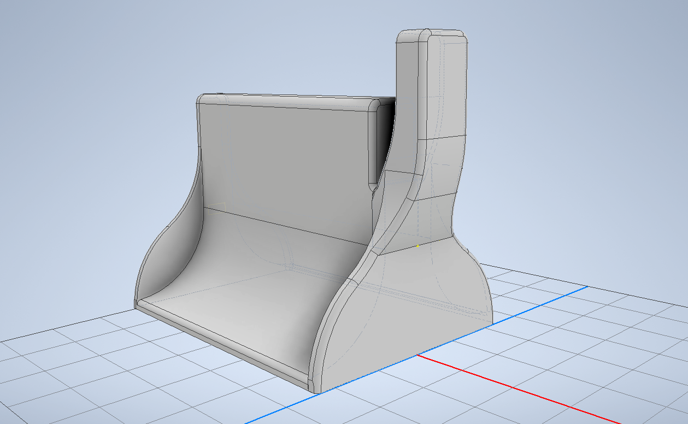

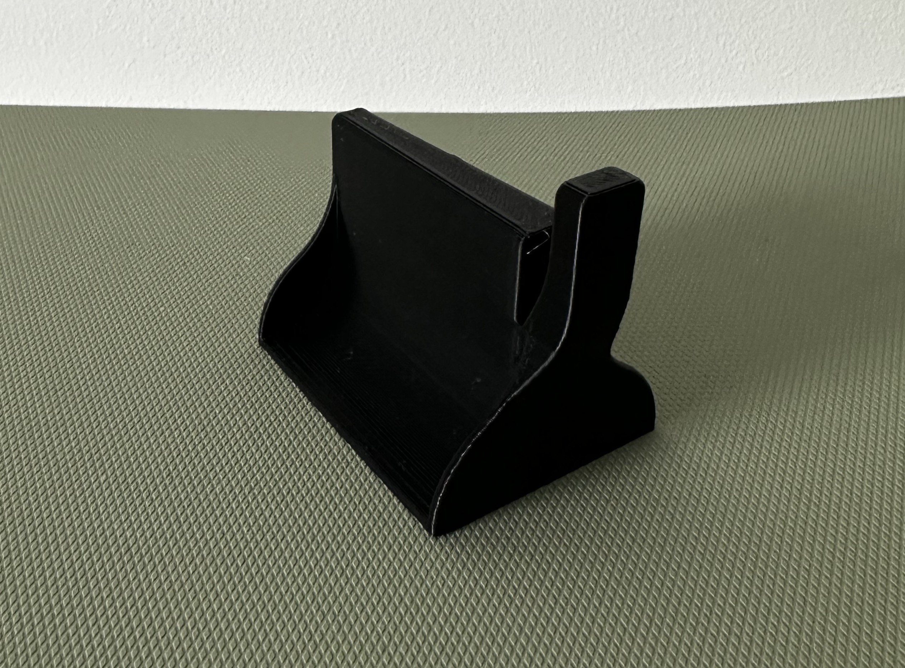

### Steering fin

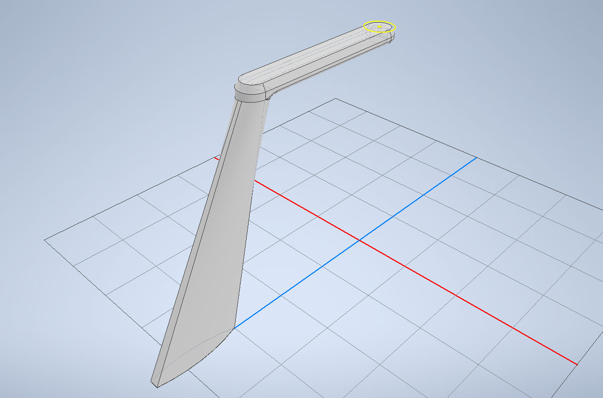

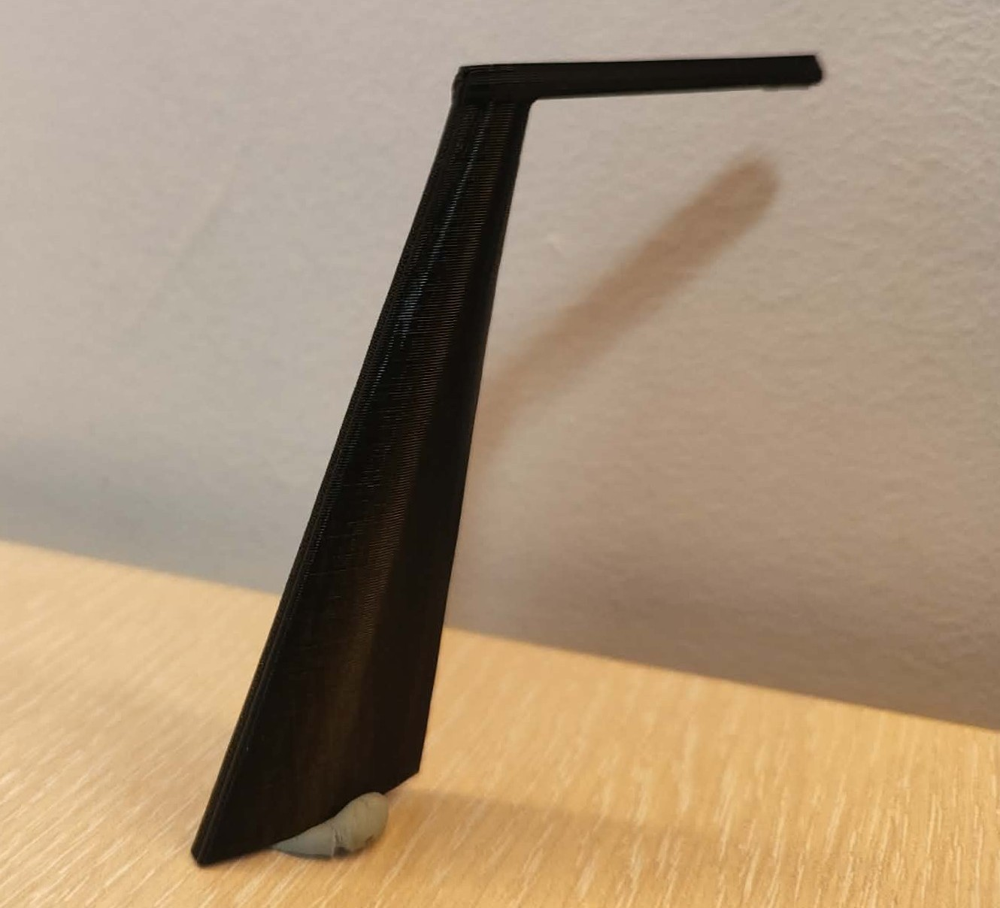

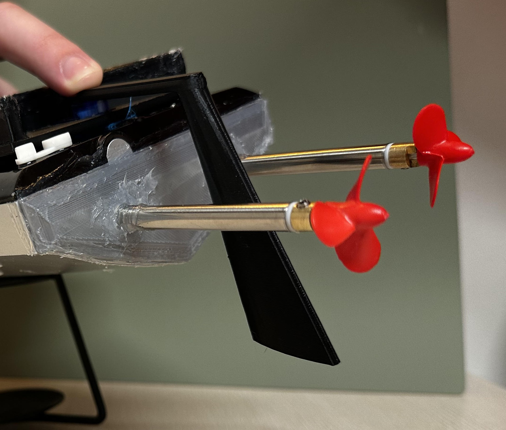

### Servo cover

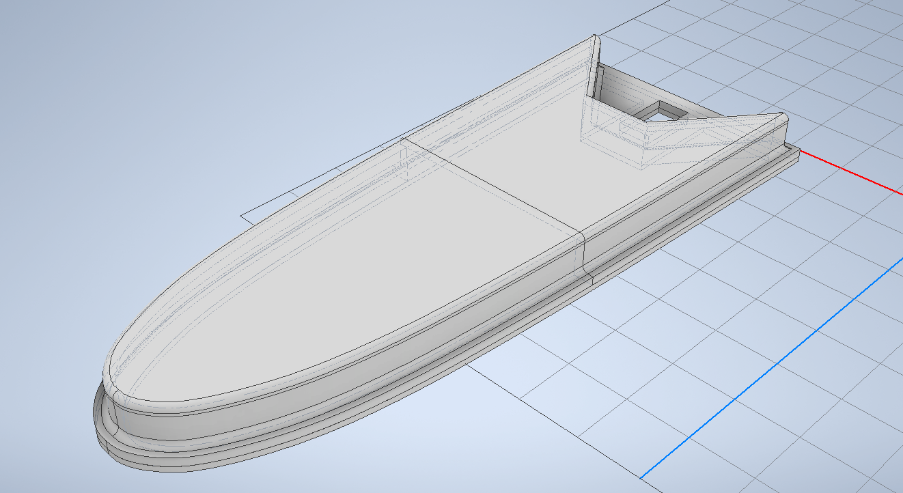

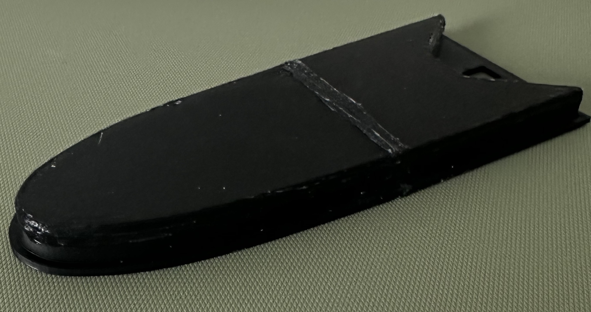

### Rear hull cap

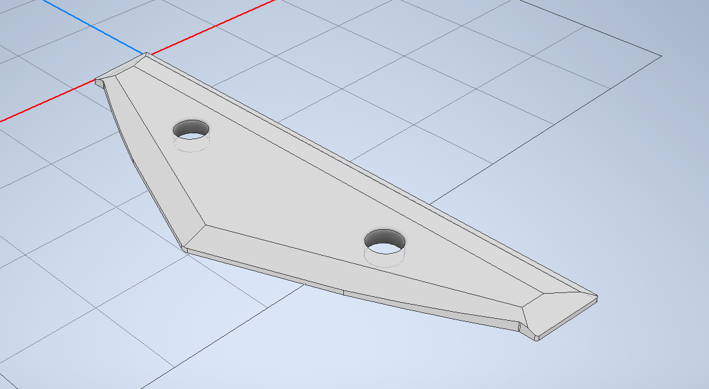

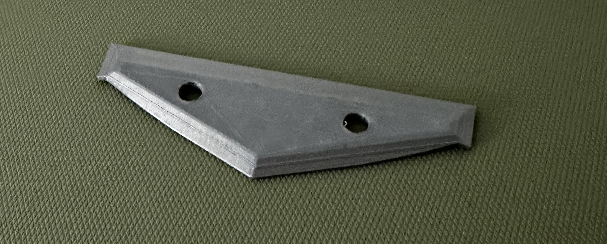

## Motor and propeller tests

Before installing the propulsion system, two- and three-blade propellers were compared on a test stand. A motor and propeller were suspended from a dynamometer. For different supply voltages, thrust was calculated from the change in the measured force; rotational speed and electrical quantities were also recorded. Solid plastic propellers were used instead of printed ones because they were considered stronger at high rotational speeds.

The two-blade propeller produced higher thrust, but also required more electrical power. The three-blade propeller produced less thrust but loaded the motor more evenly. Based on this trade-off, the three-blade propeller was selected for the initial boat configuration. The plots show results from this test setup and should not be treated as a universal comparison of propellers.

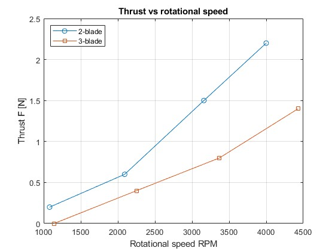

## Water-test results

The boat was tested in a swimming pool. It floated level and returned to a stable position after being tilted by hand, supporting the initial buoyancy and mass-distribution assumptions. The installed internal components had a reported total mass of 0.875 kg. The thesis compared this with an estimated reference onboard mass of 2.6 kg, based on manufacturer figures for the complete boat and bare hull.

During an approximately 25-minute test, the boat remained afloat and there were no visible signs of water ingress while it was operating. A small amount of water was found under the drive shafts after the hull was opened, so the sealing was sufficient for short-term controlled testing but was not proven fully watertight.

The boat tended to turn left during forward motion and moved in a slight zigzag when forward and reverse commands were alternated. Differential-thrust steering did not provide stable steering in this mechanical configuration. The rudder also had no noticeable effect, possibly because of the unstable forward motion or the fin’s size. The measured average speed was estimated at about 0.35 m/s from a 25 m pool length completed in approximately 70 seconds; this estimate does not account for the extra distance travelled while turning.

The IMU data could not be used for a reliable acceleration analysis. The boat’s changing direction, movement on the water and an IMU that was not rigidly aligned with the boat axes affected the readings. The software system worked, although the Wi-Fi connection between the laptop and ESP module had some issues, possibly due to the water and the small antenna.

These results show both that the boat could operate as a research platform and that its steering and sealing needed further development. Suggested next steps in the thesis include checking motor thrust symmetry and mass balance, improving the steering arrangement and antenna, and making the hull easier to open for maintenance.

## Model files

| Part | Autodesk Inventor | STL |
|---|---|---|
| Motor mount | [`motor-mount.ipt`](models/motor-mount.ipt) | [`motor-mount.stl`](models/motor-mount.stl) |
| Steering fin | [`steering-fin.ipt`](models/steering-fin.ipt) | [`steering-fin.stl`](models/steering-fin.stl) |
| Servo cover | [`servo-cover.ipt`](models/servo-cover.ipt) | [`servo-cover.stl`](models/servo-cover.stl) |
| Rear hull cap | [`rear-hull-cap.ipt`](models/rear-hull-cap.ipt) | [`rear-hull-cap.stl`](models/rear-hull-cap.stl) |

The `.ipt` files are native Autodesk Inventor part files. The STL files are mesh exports for viewing and 3D-printing workflows.

## Attribution and reuse

The four CAD/STL model pairs in the `models/` directory are released under the **Creative Commons Attribution 4.0 International (CC BY 4.0)** license. They may be used, modified and redistributed for any purpose, including commercial use, provided that credit is given to the original author and changes are indicated. See [`LICENSE-MODELS.md`](LICENSE-MODELS.md) for a suggested attribution and the license link.

Suggested attribution: *Motor mount, steering fin, servo cover and rear hull cap by Piotr Trusiewicz, from “A Remotely Operated Boat Equipped with a Set of Sensors” (2026), Poznań University of Technology. Source: https://github.com/Quittie. Changes, if any: [describe changes]. Licensed under CC BY 4.0.*

The attribution above applies to the models in `models/`; it does not relicense the purchased hull, third-party components, or materials by the other thesis author.
